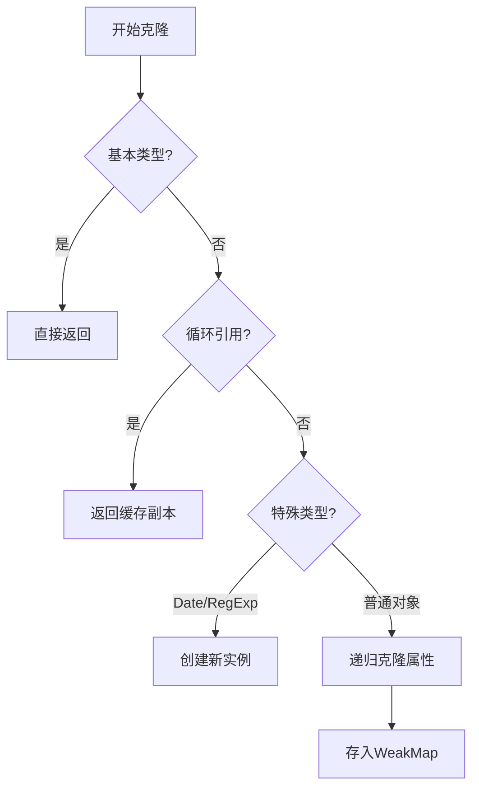

# ObjectUtils <Badge type="tip" text="工具类" />

:::info 对象操作工具集
提供全面的对象操作工具方法，包括深度克隆、深度合并、属性筛选等，所有方法均支持TypeScript类型推断。
:::

## 核心功能

- 🌀 **深度克隆** - 支持循环引用和特殊对象类型
- 🧩 **深度合并** - 可配置的合并策略
- 🔍 **属性筛选** - 类型安全的pick/omit操作
- ⚖️ **深度比较** - 精确的对象结构比较
- 🧹 **空值检查** - 全面的空对象检测

## 方法总览

| 方法 | 描述 | 类型安全 |
|------|------|---------|
| `isEmpty` | 检查对象是否为空 | ✅ |
| `deepClone` | 创建对象的深度拷贝 | ✅ |
| `deepMerge` | 深度合并多个对象 | ✅ |
| `omit` | 排除指定属性 | ✅ |
| `pick` | 选取指定属性 | ✅ |
| `isEqual` | 深度对象比较 | ✅ |

## 详细用法

### 空值检查

```typescript
ObjectUtils.isEmpty(null);         // true
ObjectUtils.isEmpty(undefined);    // true
ObjectUtils.isEmpty({});           // true
ObjectUtils.isEmpty({ a: 1 });     // false
```

### 深度克隆

```typescript
const original = {
  date: new Date(),
  nested: { a: 1 }
};

const cloned = ObjectUtils.deepClone(original);

// 处理循环引用
const obj = { self: null };
obj.self = obj;
const safeClone = ObjectUtils.deepClone(obj); // 不会栈溢出
```

### 深度合并

```typescript
const target = { a: 1, b: { c: 2 } };
const source = { b: { d: 3 }, e: 4 };

// 默认合并（覆盖+深拷贝）
const merged = ObjectUtils.deepMerge(target, source);
// { a: 1, b: { c: 2, d: 3 }, e: 4 }

// 自定义合并策略
const customMerge = ObjectUtils.deepMerge(
  target,
  source,
  { overwrite: false, cloneDeep: false }
);
```

### 属性操作

```typescript
type User = {
  id: number;
  name: string;
  password: string;
};

const user: User = {
  id: 1,
  name: 'Alice',
  password: 'secret'
};

// 排除敏感字段
const safeUser = ObjectUtils.omit(user, ['password']);
// { id: 1, name: 'Alice' }

// 选择特定字段
const publicInfo = ObjectUtils.pick(user, ['id', 'name']);
// { id: 1, name: 'Alice' }
```

### 深度比较

```typescript
const a = { x: { y: 1 } };
const b = { x: { y: 1 } };

ObjectUtils.isEqual(a, b); // true

// 特殊类型比较
const d1 = new Date('2023-01-01');
const d2 = new Date('2023-01-01');
ObjectUtils.isEqual(d1, d2); // true
```

## 高级用法

### 自定义合并策略

```typescript
const config = {
  api: {
    baseUrl: '/api',
    timeout: 5000
  }
};

const override = {
  api: {
    timeout: 3000
  }
};

// 只更新存在的属性
const mergedConfig = ObjectUtils.deepMerge(
  config,
  override,
  { overwrite: true, cloneDeep: false }
);
```

### 循环引用处理

```typescript
const cyclicObj = { data: null };
cyclicObj.data = cyclicObj;

// 安全克隆
const clonedCyclic = ObjectUtils.deepClone(cyclicObj);
console.log(clonedCyclic.data === clonedCyclic); // true
```

### 类型安全操作

```typescript
interface Product {
  id: string;
  name: string;
  price: number;
  details?: {
    manufacturer: string;
  };
}

const product: Product = { /*...*/ };

// 类型安全的pick
const productPreview = ObjectUtils.pick(product, ['id', 'name']);
// 类型推断为 Pick<Product, 'id' | 'name'>
```

## 实现细节

### 深度克隆算法



### 深度比较逻辑

1. **基本类型**：直接使用`===`比较
2. **特殊对象**：
   - Date：比较时间戳
   - RegExp：比较字符串表示
3. **复杂对象**：
   - 比较属性数量
   - 递归比较每个属性

## 最佳实践

### 性能优化

```typescript
// 对大对象使用结构化克隆（如果环境支持）
if (typeof structuredClone === 'function') {
  return structuredClone(obj);
}

// 需要部分更新时使用pick而不是clone
const updateUser = (user: User, changes: Partial<User>) => {
  return ObjectUtils.deepMerge(
    ObjectUtils.pick(user, ['id']),
    changes
  );
};
```

### 不可变数据

```typescript
// 在Redux reducer中的应用
function reducer(state, action) {
  switch (action.type) {
    case 'UPDATE':
      return ObjectUtils.deepMerge(
        state,
        action.payload,
        { overwrite: true }
      );
    default:
      return state;
  }
}
```

### 安全模式

```typescript
// 防止原型污染
const safeClone = (obj: any) => {
  const clone = ObjectUtils.deepClone(obj);
  if (clone.__proto__ !== Object.prototype) {
    clone.__proto__ = Object.prototype;
  }
  return clone;
};
```

## 注意事项

1. **函数克隆**：方法不会克隆函数（保留原引用）
2. **Symbol属性**：会被忽略（考虑使用`Object.getOwnPropertySymbols`扩展）
3. **性能考量**：深度操作大型对象可能影响性能
4. **浏览器环境**：考虑使用`structuredClone` API（如果可用）

